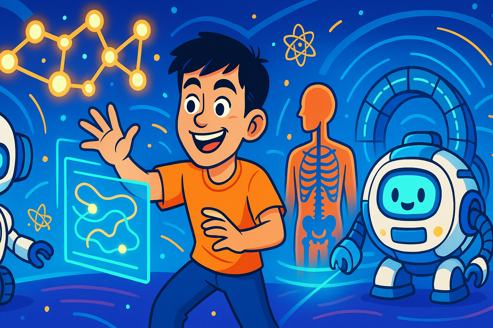

<!-- ─────────────────────────────  PROFILE README  ──────────────────────────── -->
<h1 align="center">Hey 👋, I’m Ledi Wang</h1>
<h3 align="center">Medical-Physics Graduate student · CS & Physics · 🚀 AI-for-Radiation-Oncology advocate</h3>

<div align="center">
  <a href="https://orcid.org/0000-0000-0000-0000"></a>
  <a href="https://scholar.google.com/citations?user=<id>"></a>
  <a href="https://www.linkedin.com/in/ledi-wang-908697287"></a>
</div>

---

<!-- Profile banner -->
<p align="center">
  
</p>
This is me playing happily in the world of AI, Medical Physics, and Radiation Oncology.

---

### 🔬 What I’m all about  
I blend **computer science, physics, and clinical insight** to push advanced AI from the lab bench to the *linear accelerator*.  
My current fascinations:

| Theme | Why it matters |
|-------|----------------|
| **Auto-segmentation** 🤖✂️ | DL models now draw organs-at-risk & targets in *seconds*, improving consistency and freeing up planners for higher-value work. |
| **Dose prediction & KBP 2.0** 📈 | CNNs predict 3-D dose matrices before optimization, guiding planners toward Pareto-optimal solutions. |
| **Online adaptive RT** 🔄 | Rapid image-driven re-planning at the machine—AI is the brains that decides *when* adaptation is worth it. |
| **AI-powered QA** 🛡️ | Anomaly-detection networks flag gantry, MLC, and imaging drifts long before they jeopardize a patient. |
| **Explainability & ethics** ⚖️ | I research saliency mapping + uncertainty quantification to keep the “black-box” transparent at the bedside. |

> “From *click-happy script* ➡️ *clinically validated model* in record time.”

---
(ignore the rest, AI generated, testing template)

### 📚 Featured projects
| Repo | Pitch |
|------|-------|
| [**AutoContourNet**](https://github.com/<username>/AutoContourNet) | Lightweight U-Net variant that trains on-the-fly with 2-D/3-D hybrids for CT-based OAR segmentation. |
| [**DeepDosePredict**](https://github.com/<username>/DeepDosePredict) | Voxel-level dose predictors that plug into Eclipse via the ESAPI and spit out instant DVH estimates. |
| [**RadQA-GAN**](https://github.com/<username>/RadQA-GAN) | GAN-based extinction maps for pre-treatment portal-dosimetry QA. |

_Pinned projects sit below—feel free to clone, fork, issue-spam, or PR!_

---

### 📝 Recent papers & preprints
- **“Fully Automated Online Adaptive RT Decision-Making for Cervical Cancer”** – *Med. Phys.*, 2025.  
- **“Patient-Specific Deep Learning Auto-Segmentation for MR-Guided Adaptive Therapy”** – *Phys. Med. Biol.*, 2024.  
*(see `/publications` for BibTeX & slides)*

---

### ✨ Fun corner
|   |   |
|---|---|
|  | **ASCII-LINAC**<br>```          ____<br> O====/    \ <br>     /_____/``` |

- ☕ &nbsp;Will debug for espresso  
- 🧗 &nbsp;Crack-climbing aficionado  
- 💬 &nbsp;Ask me about *open-source TPS* hacks

---

### 📊 GitHub stats
<div align="center">
  &show_icons=true&hide_rank=true&theme=default" />
  &layout=compact" />
</div>

---

### 🤝 Let’s connect
- **Email:** you@institution.edu  
- **Twitter / X:** [@yourhandle](https://twitter.com/yourhandle)  
- **Mastodon:** @[handle]@medphys.social  

> *“The best way to predict the future is to irradiate it—safely, accurately, and with a sprinkle of AI.”*

<!-- ─────────────────────────────────────────────────────────────────────────── -->
